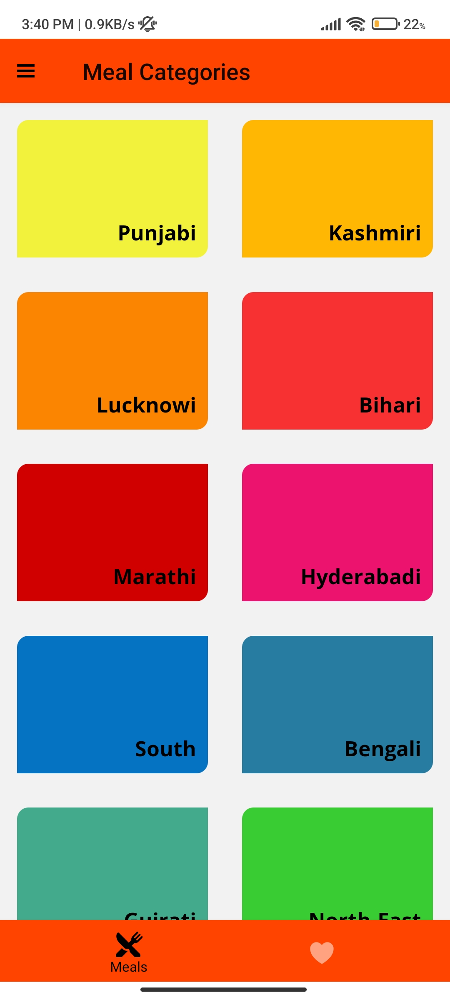
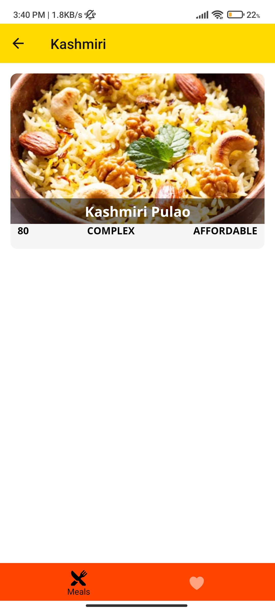
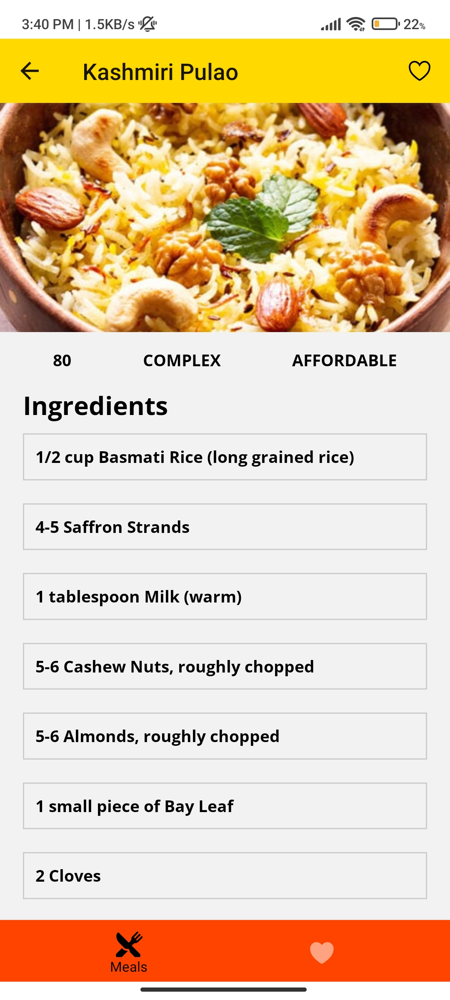
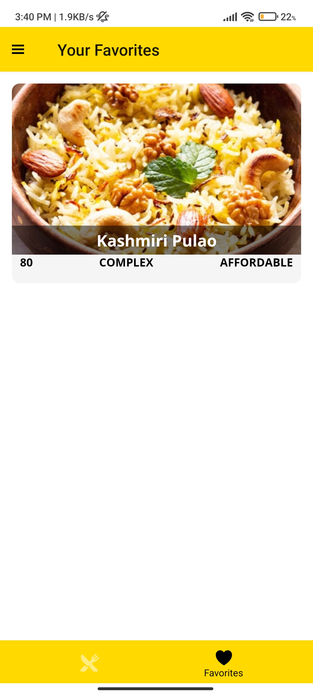
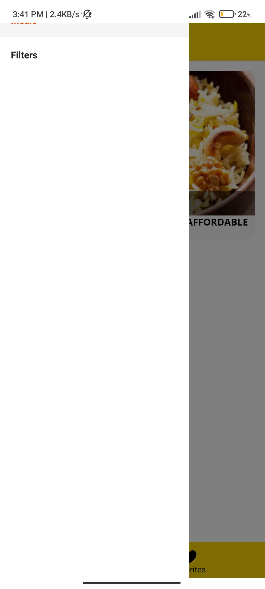
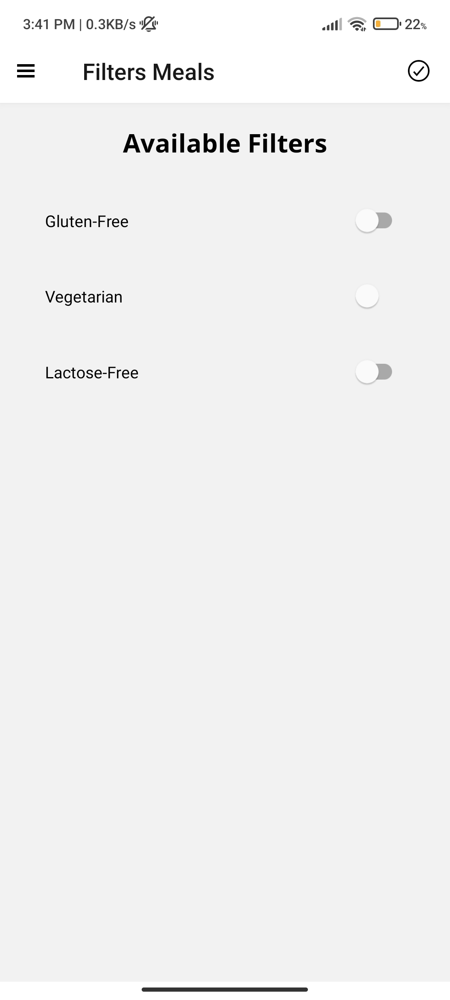

<h1>Sid Recipe</h1>
<h4>A recipe app using React Navigation and Redux.</h4>

<h2>Features</h2> 
displaying recipes by category. 
adding a recipe to favorites. 
filtering recipes (gluten-free, lactose-free, vegan & vegetarian). 
<h2>React Navigation</h2>
handling stack of screens for recipes, favorites and filters with createStackNavigator and createAppContainer. 
using props.navigation to navigate between screens. 
handling data from component to header with setParams and getParam. 
custom header title with navigationOptions. 
using react-native-screens for better performance. 
custom buttons in the header with react-navigation-header-buttons. 
adding bottom tabs with react-navigation-tabs. 
custom style on Android with react-navigation-material-bottom-tabs. 
custom SideDrawer with react-navigation-drawer. 
<h2>Redux and React-Redux</h2>
using actions and reducers to store favorite recipes and filtered recipes. 
handling logic to filter recipes. 
using useSelector hook to get the state. 
using props.navigation to pass data to the header without re-render. 
using useDispatch hook to dispatch actions. 
passing useDispatch to the header with useEffect and useCallback to limit re-render cycles. 
<h2>React Native</h2>
using FlatList, TouchableOpacity, ScrollView, ImageBackground, Switch. 
custom components for category card and recipe item. 
custom fonts and color constants. 
using React hooks (useState, useEffect, useCallback). 
Based on <a href="https://www.udemy.com/course/react-native-the-practical-guide/?utm_source=adwords&utm_medium=udemyads&utm_campaign=LongTail_la.EN_cc.INDIA&utm_content=deal4584&utm_term=_._ag_77882236463_._ad_533220806573_._kw__._de_c_._dm__._pl__._ti_dsa-1007766171312_._li_9062116_._pd__._&matchtype=b&gclid=CjwKCAiA1uKMBhAGEiwAxzvX91R-0Kg6AbWE-Wi2SDXY1Nk3n1r_zjRn2koWtGT068HJ8qPt8C2mChoCy4kQAvD_BwE">React Native - The Practical Guide by Maximilian Schwarzmüller.</a> 
<h3>Download Expo-client App on android or ios and scan the barcode to run the App</h3>

<h4>Some ScreenShots</h4>

